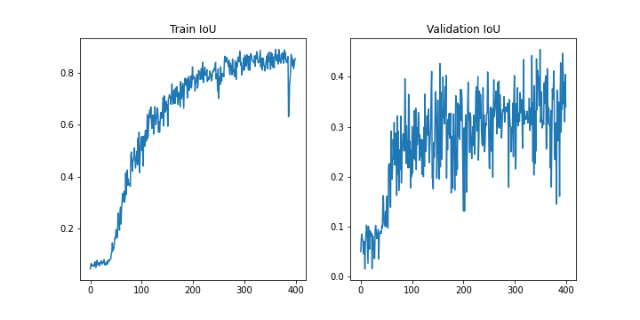
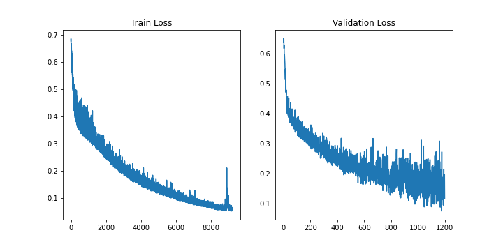
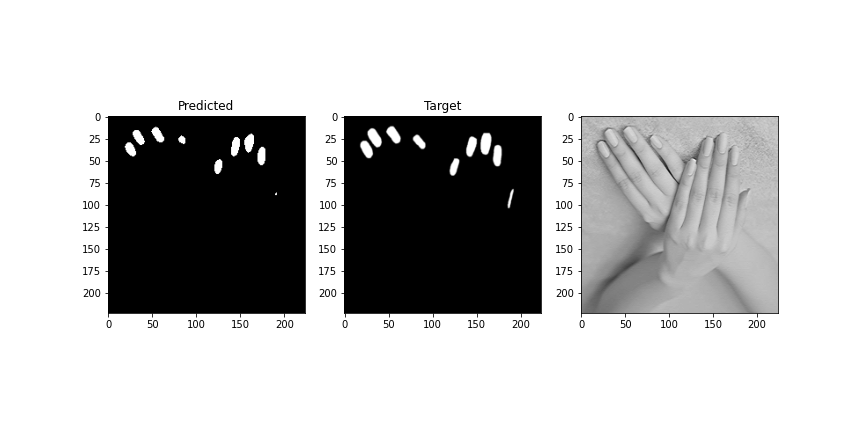

# Nail Segmentation Project
This progect uses UNet architecture. See *Ronneberger O., Fischer P., Brox T. U-Net: Convolutional Networks for Biomedical Image Segmentation. CoRR, 2015. URL: https://arxiv.org/abs/1505.04597. Ronneberger O., Fischer P., Brox T. U-Net: Convolutional Networks for Biomedical Image Segmentation. CoRR, 2015. URL: https://arxiv.org/abs/1505.04597.*
## Setup and Run Instructions

### Step 1:Download the Model Checkpoint
Download the `model_checkpoint.pth` file into the repository directory. This contains the project's model. Reference for downlad: [google drive](https://drive.google.com/drive/u/0/folders/1sZe0mmBQG9SMiYrKbWoTLHRMpXM93Fg-)

### Step 2: Download and Prepare the Dataset
Download the dataset from the website [Nails Segmentation Dataset](https://www.kaggle.com/datasets/vpapenko/nails-segmentation) and place it in the repository directory. The dataset folder should contain two subfolders: `images` (containing nail images) and `labels` (containing corresponding labels).

### Step 3: Configure the Settings
Edit the `config.yaml` file to specify the absolute path to the dataset and the paths where you want to save the loss function plots, IoU plots, and the trained model.

### Step 4: Run the Training Script
Run the `Launch.sh` script to start the training process. This script will check for required libraries and launch the training.

### Step 5: Explore the Model Training and Testing
Open the `nail_segmentation_presentation.ipynb` file to view the details of the model training and testing on the entire dataset.

**Note:** Make sure to update the paths in the `config.yaml` file to match your local directory structure. Also, ensure that the dataset is correctly downloaded and placed in the repository directory.

## Losses during training: IoU metric and BCEWithLogitsLoss
  
## Test of the model

